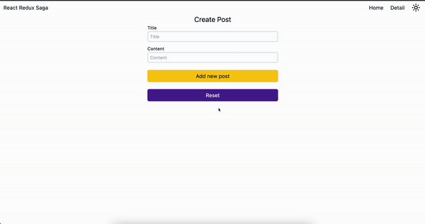

# Getting Started React App with Typescript, Redux Toolkit, Redux Saga, React Hook Form

The repository is dedicated to a React App with Typescript, Redux Toolkit, Redux Saga, React Hook Form

<h1 align="center">
  SAWADOGO Badini Ibrahim
</h1>

[](https://github.com/badiniibrahim)

[](mailto:sawadogo.badiniibrahim@gmail.com)

[](https://www.linkedin.com/in/badini-ibrahim-s-306b119b/)

## About this Repository
<div align="center">


</div>

## Technologies
- React.js
- Beautiful layouts with TailwindCSS
- Redux Toolkit
- Redux Saga
- React Hook Form


### [LiveSite](https://react-redux-rtk-saga-tailwindcss-typescript.vercel.app/)

<div align="center">



</div>

### Features
1. [React.js](https://reactjs.org/) CRUD example with Redux Saga.
2. [Typescript](https://www.typescriptlang.org/) for type safety
4. Core libraries
    * [Redux](https://redux.js.org/)
    * [Redux Toolkit](https://redux-toolkit.js.org/)
    * [Redux Saga](https://redux-saga.js.org/)
    * [React Router](https://reactrouter.com/)
    * [React Hook Form](https://react-hook-form.com/)
    * [Yup](https://github.com/jquense/yup)
    * [Axios](https://github.com/axios/axios)
    * [Tailwindcss](https://tailwindcss.com/)
5. Other tools/libraries
    * [StoryBook](https://storybook.js.org/)
      
6. Tailwindcss UI Dark Mode support

   ## :running: Run Locally

Clone the project

```bash
  git clone https://github.com/badiniibrahim/react-redux-rtk-saga-tailwindcss-typescript.git
```
## Installation

```bash
$ yarn install
```
